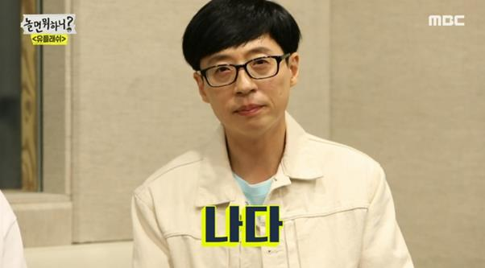

# PyTorch VDSR
Implementation of CVPR2016 Paper: "Accurate Image Super-Resolution Using 
Very Deep Convolutional Networks"(http://cv.snu.ac.kr/research/VDSR/) in PyTorch

## Usage
### Training
```
usage: main_vdsr.py [-h] [--batchSize BATCHSIZE] [--nEpochs NEPOCHS] [--lr LR]
               [--step STEP] [--cuda] [--resume RESUME]
               [--start-epoch START_EPOCH] [--clip CLIP] [--threads THREADS]
               [--momentum MOMENTUM] [--weight-decay WEIGHT_DECAY]
               [--pretrained PRETRAINED] [--gpus GPUS]
               
optional arguments:
  -h, --help            Show this help message and exit
  --batchSize           Training batch size
  --nEpochs             Number of epochs to train for
  --lr                  Learning rate. Default=0.01
  --step                Learning rate decay, Default: n=10 epochs
  --cuda                Use cuda
  --resume              Path to checkpoint
  --clip                Clipping Gradients. Default=0.4
  --threads             Number of threads for data loader to use Default=1
  --momentum            Momentum, Default: 0.9
  --weight-decay        Weight decay, Default: 1e-4
  --pretrained PRETRAINED
                        path to pretrained model (default: none)
  --gpus GPUS           gpu ids (default: 0)
```
An example of training usage is shown as follows:
```
python main_vdsr.py --cuda --gpus 0
```

### Evaluation
```
usage: evaluation.py [--image1 PATH] [--image2 PATH]

optional arguments:
  --image1           Path to the first image
  --image2           Path to the second image
```
An example of training usage is shown as follows:
```
python evaluation.py
```

### Demo
```
usage: test.py [--cuda] [--model MODEL] [--input_dir DIRECTORY] [--output_dir DIRECTORY][--scale SCALE] [--gpus GPUS]
               
optional arguments:
  --cuda                Use cuda
  --model               Model path. Default=model/model_epoch_50.pth
  --input_dir           Input path. Default="datas/"
  --output_dir          Output path. Default="result/"
  --scale               Scale factor, Default: 4
  --gpus GPUS           gpu ids (default: 0)
```
An example of usage is shown as follows:
```
python test.py --model model/model_epoch_50.pth --cuda
```

### Prepare Training dataset
  - We provide a simple hdf5 format training sample in data folder with 'data' and 'label' keys, the training data is generated with Matlab Bicubic Interplotation, please refer [Code for Data Generation](https://github.com/twtygqyy/pytorch-vdsr/tree/master/data) for creating training files.

### Performance
  - We provide a pretrained VDSR model trained on [291](https://drive.google.com/open?id=1Rt3asDLuMgLuJvPA1YrhyjWhb97Ly742) images with data augmentation
  - No bias is used in this implementation, and the gradient clipping's implementation is different from paper
  - Performance in PSNR on Set5
  
| Scale        | VDSR Paper          | VDSR PyTorch|
| ------------- |:-------------:| -----:|
| 2x      | 37.53      | 37.65 |
| 3x      | 33.66      | 33.77|
| 4x      | 31.35      | 31.45 |

### Result
<p>
  
  
</p>
